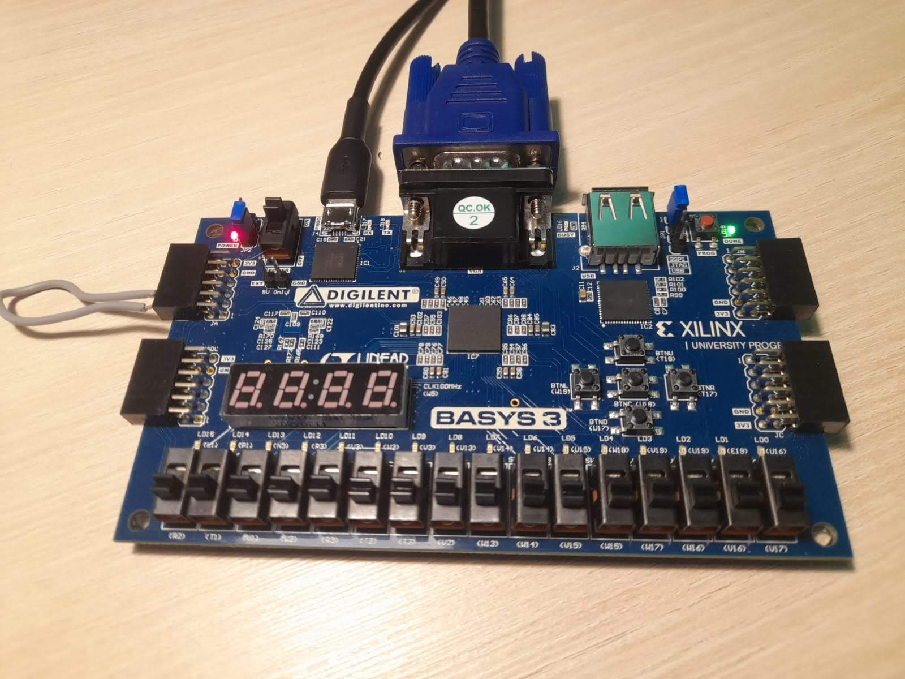
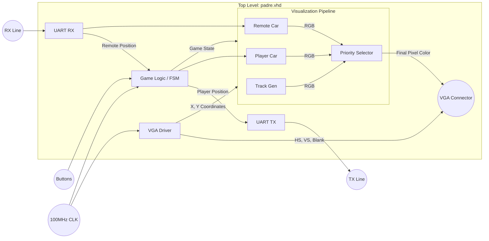

<h1>🏎️ FPGA Racing Game</h1>

  

 

A **VHDL-based racing game** implementation for the **Basys 3 FPGA** board. This project uses a custom VGA driver to display the game interface and implements real-time logic for car movement, collision detection, and UART communication to play the game with another player.

## 🛠️ Hardware Setup

*FPGA Board Setup*

## 🏗️ System Architecture

The following block diagram represents the internal hardware structure of the design:

*Block Diagram of VHDL instances*

## 🎮 Gameplay

Click the image below to watch the gameplay video.

*Gameplay Video with the TX and RX lines connected*

## 📂 Project Structure

The repository is organized as follows:

- **`src/`**: Source files.
  - **`hdl/`**: 🧠 VHDL source code (Logic, FSM, VGA Driver).
  - **`constraints/`**: 📐 XDC constraints file for Basys 3.
  - **`ip/`**: 🧱 IP Cores and Coefficient files (`.coe`).
- **`media/`**: 📷 Images and videos of the project.
- **`docs/`**: 📄 Documentation (`Proyecto_FPGA.pdf`).

## 🚀 How to Run

1.  **Open Vivado**.
2.  **Create a New Project** and select the **Basys 3** board (Artix-7).
3.  **Program Device**: Connect the Basys 3 board via USB and program it with the generated `.bit` file.

## ✨ Features

- 🖥️ **VGA Video Output** (640x480 @ 60Hz)
- 🚗 **Real-time car movement**
- 📡 **Communication** with a remote car via UART
- 💥 **Collision detection**
- 🔄 **Finite State Machines (FSM)** for game control

---

*Developed by Fernando Román, Marta Barroso and José Chaqués | Electronics Systems Course, University of Seville*
